# Architecture Diagrams

Visual representations of the Social Posting Scheduler architecture, data flows, and system interactions.

## Table of Contents

- [System Architecture](#system-architecture)
- [Authentication Flow](#authentication-flow)
- [Post Publishing Flow](#post-publishing-flow)
- [OAuth Connection Flow](#oauth-connection-flow)
- [Data Model](#data-model)
- [Error Handling and Retry Logic](#error-handling-and-retry-logic)
- [Token Refresh Flow](#token-refresh-flow)
- [Component Architecture](#component-architecture)

---

## System Architecture

### High-Level Overview

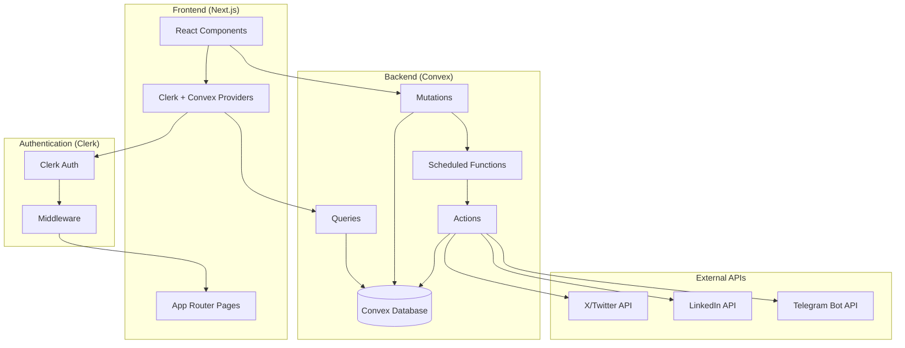

### Technology Stack

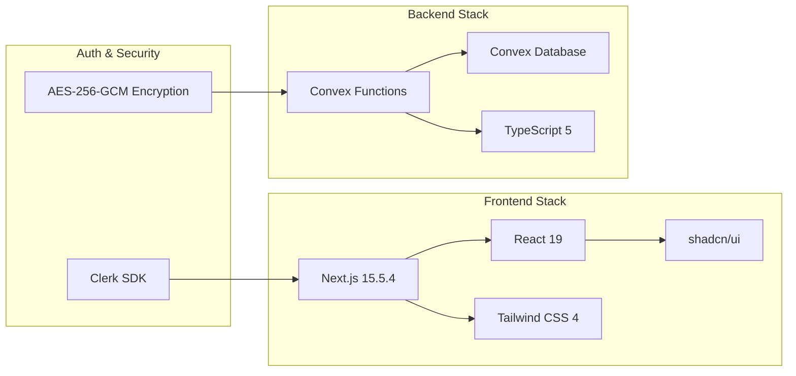

---

## Authentication Flow

### User Authentication Workflow

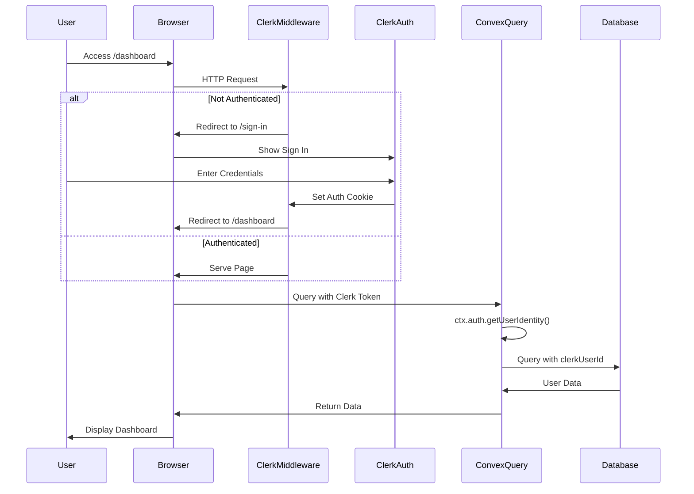

### Convex Function Authentication

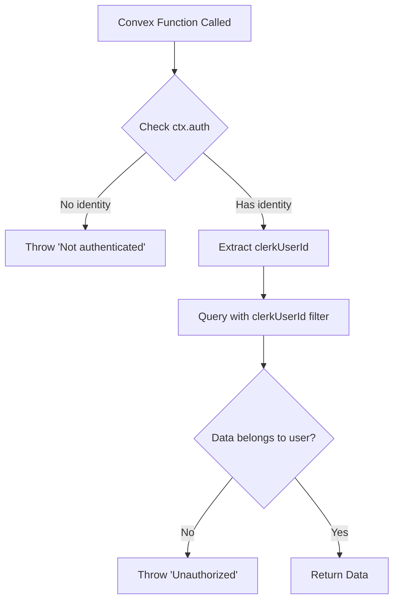

---

## Post Publishing Flow

### Complete Publishing Workflow

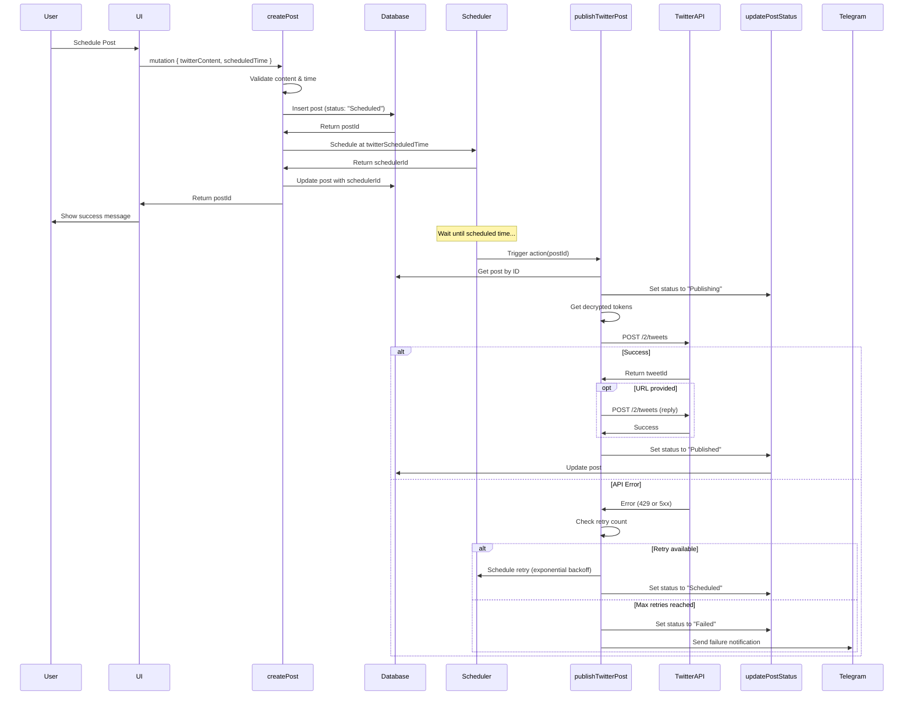

### Post Status State Machine

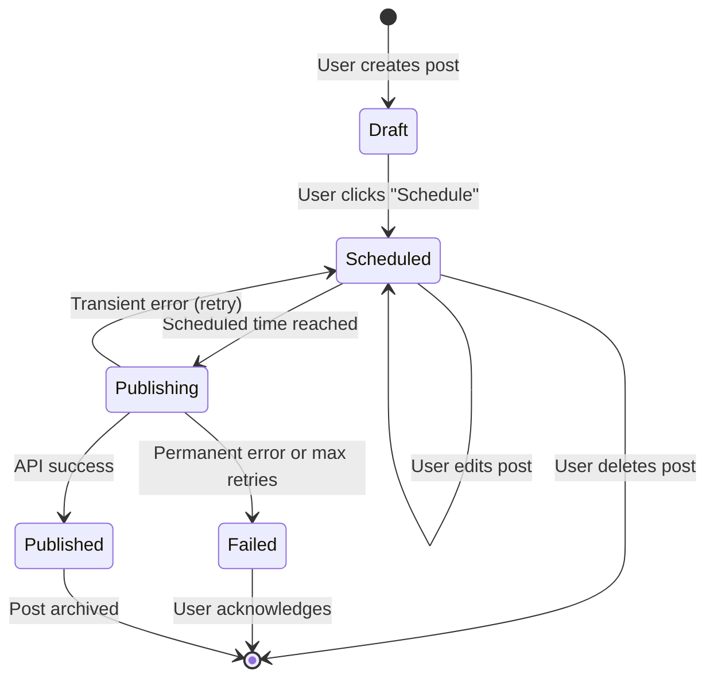

---

## OAuth Connection Flow

### Twitter/LinkedIn OAuth Integration

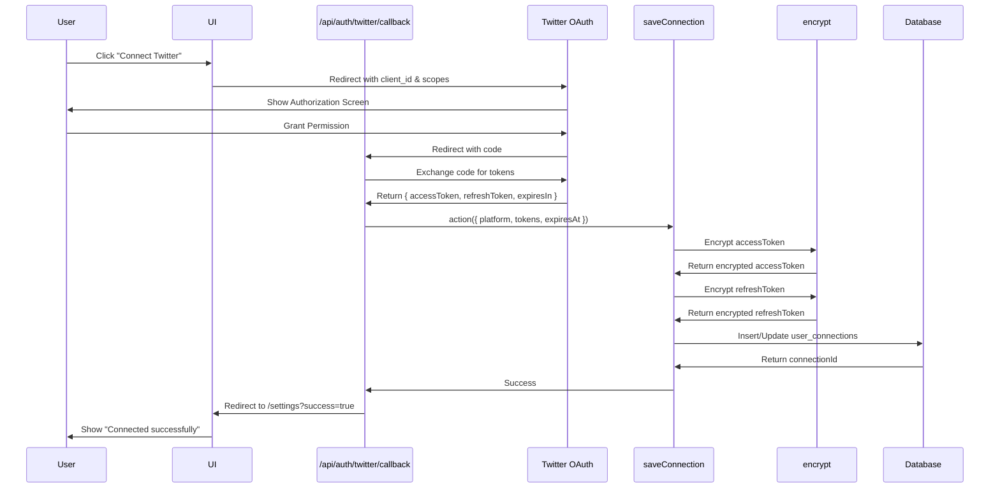

### Connection Status Check

```mermaid
graph TD
    A[getConnectionStatus Query] --> B[Query user_connections]
    B --> C{Connection exists?}
    C -->|No| D[Return { connected: false, needsReauth: false }]
    C -->|Yes| E{Token expired?}
    E -->|No| F[Return { connected: true, needsReauth: false, expiresAt }]
    E -->|Yes| G[Return { connected: true, needsReauth: true, expiresAt }]
```

---

## Data Model

### Database Schema

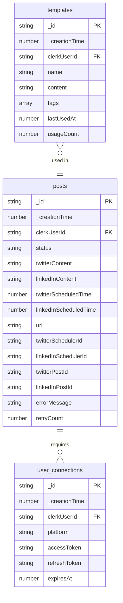

### Index Structure

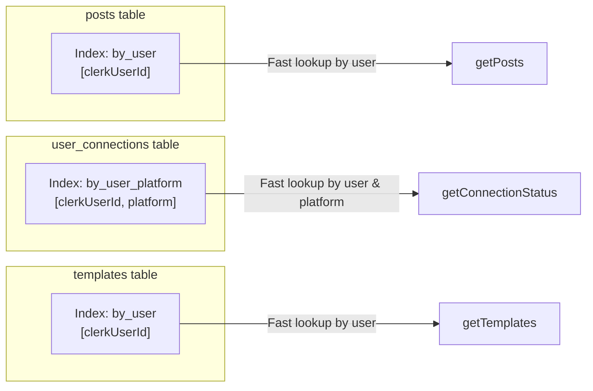

---

## Error Handling and Retry Logic

### Retry Decision Flow

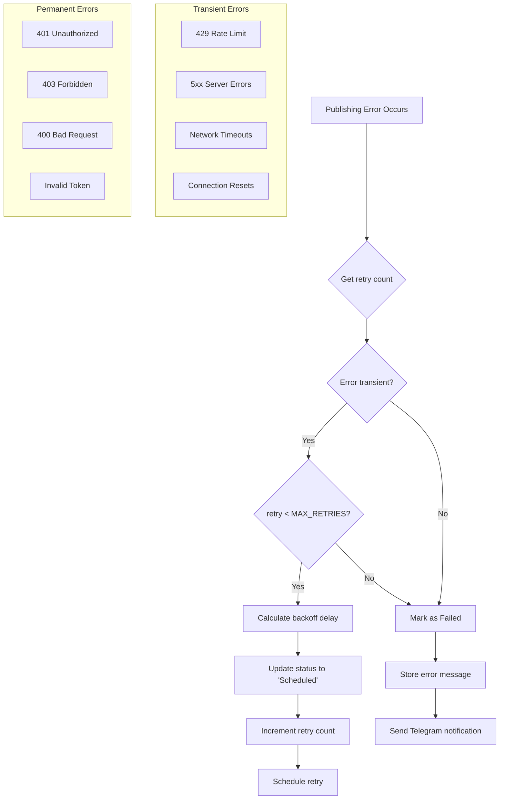

### Exponential Backoff Strategy

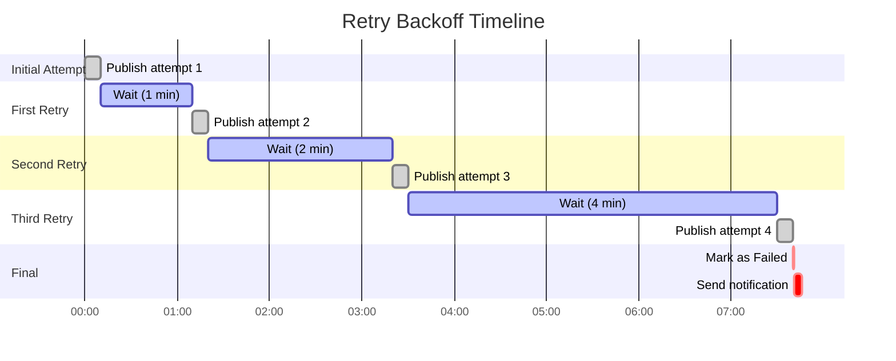

---

## Token Refresh Flow

### LinkedIn Token Refresh Workflow

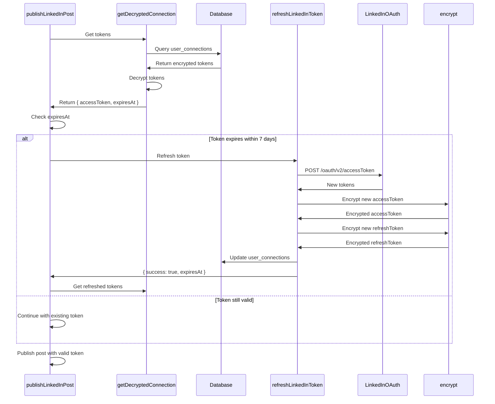

### Token Expiration Timeline

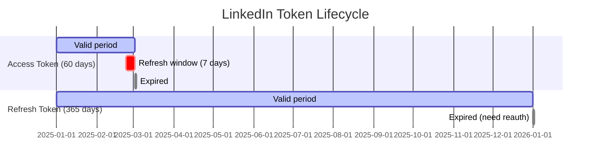

---

## Component Architecture

### Frontend Component Hierarchy

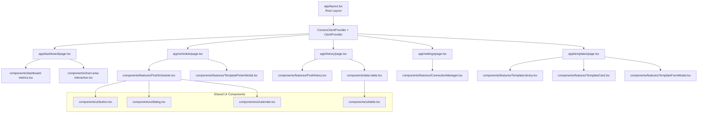

### Data Flow Architecture

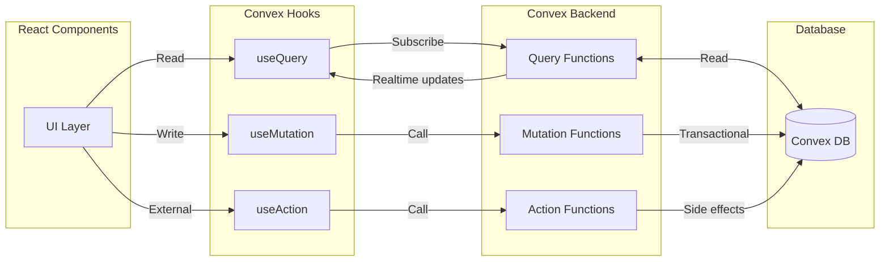

### Realtime Updates Flow

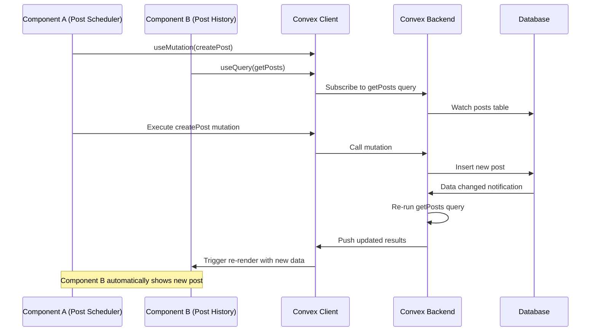

---

## Security Architecture

### Encryption Flow

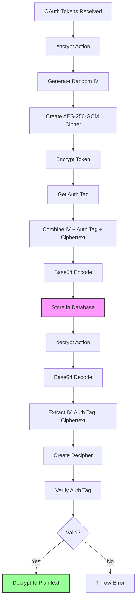

### Security Layers

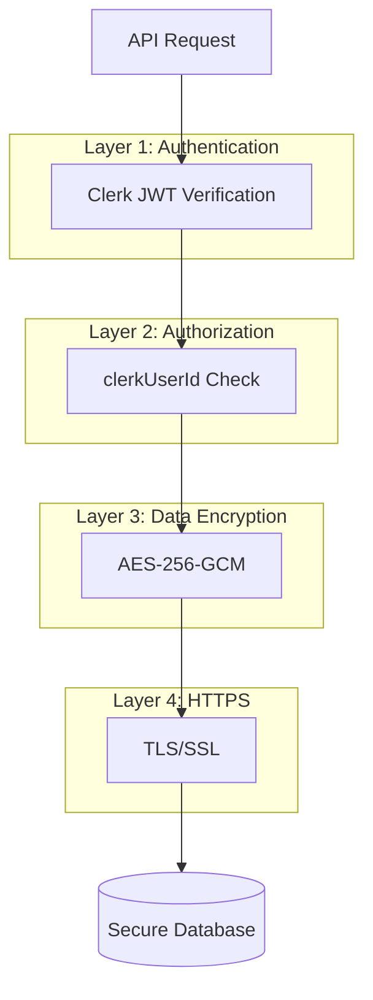

---

## Deployment Architecture

### Production Infrastructure

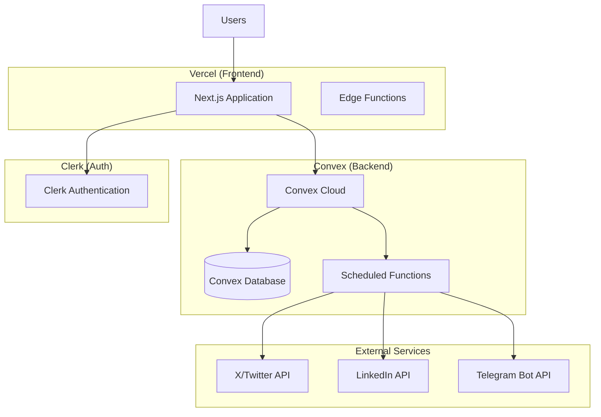

---

## Performance Considerations

### Query Optimization

```mermaid
graph TD
    A[Query Request] --> B{Has Index?}
    B -->|Yes| C[Index Scan O(log n)]
    B -->|No| D[Full Table Scan O(n)]

    C --> E[Fast Result <100ms]
    D --> F[Slow Result >1s]

    style C fill:#9f9
    style D fill:#f99
    style E fill:#9f9
    style F fill:#f99
```

### Caching Strategy

```mermaid
graph LR
    subgraph "Client"
        ReactQuery[Convex Client Cache]
    end

    subgraph "Network"
        HTTP[HTTP Request]
    end

    subgraph "Server"
        ConvexCache[Convex Query Cache]
        DB[(Database)]
    end

    Component[React Component] -->|useQuery| ReactQuery
    ReactQuery -->|Cache miss| HTTP
    HTTP --> ConvexCache
    ConvexCache -->|Cache miss| DB
    DB -->|Data| ConvexCache
    ConvexCache -->|Data| HTTP
    HTTP -->|Data| ReactQuery
    ReactQuery -->|Realtime updates| Component
```

---

## Additional Resources

- [Convex Architecture Docs](https://docs.convex.dev/production/architecture)
- [Next.js App Router](https://nextjs.org/docs/app)
- [Clerk Authentication Flow](https://clerk.com/docs/authentication/overview)
- [Project PRD](./prd.md)
- [Architecture Document](./architecture.md)
- [API Reference](./API_REFERENCE.md)
